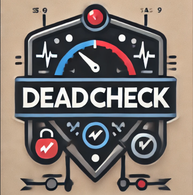
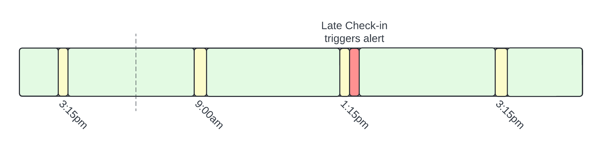

[](https://github.com/adamdecaf/deadcheck)

# deadcheck

[](https://godoc.org/github.com/adamdecaf/deadcheck)
[](https://github.com/adamdecaf/deadcheck/actions)
[](https://codecov.io/gh/adamdecaf/deadcheck)
[](https://goreportcard.com/report/github.com/adamdecaf/deadcheck)
[](https://raw.githubusercontent.com/adamdecaf/deadcheck/master/LICENSE)
[](https://hub.docker.com/r/adamdecaf/deadcheck)


Deadcheck is a versatile [dead man's switch](https://en.wikipedia.org/wiki/Dead_man's_switch) designed to be independent of the infrastructure hosting it. The project allows users to set up checks that must be periodically "confirmed" to indicate that everything is fine. If a check isn't confirmed within the specified time, Deadcheck triggers a set of actions, such as sending alerts or executing tasks to ensure that the necessary steps are taken in the event you're no longer able to do so.

Deadcheck is an automated dead man's switch that **doesn't rely on its own uptime**. Instead, it uses external services for final triggers, ensuring alerts and actions occur even if the hosting infrastructure is down. Deadcheck relies on third parties (e.g., PagerDuty) to handle alerts when a check is missed.

## Features

- Decoupled from Hosting Infrastructure: Deadcheck ensures that the actual execution of alerts or incidents happens independently from the infrastructure hosting it. Even if the Deadcheck server goes down, the check-in process will still trigger events using external services.
- Configurable Check Intervals: Flexible check intervals allow you to set up switches ranging from short-term (hours) to long-term (months).
- Provider-Agnostic Setup: Deadcheck is designed to integrate with a variety of external systems, allowing for a wide range of customization in how your dead man's switch operates.



## Install

Download the [latest release for your architecture](https://github.com/adamdecaf/deadcheck/releases/latest).

## Configuration
```yaml
checks:
  - id: "hourly-sync"
    name: "Upload data every hour"
    description: "<string>"
    schedule:
      every:
        interval: "1h"
        start: "14:00"
        end: "18:00"
    # Override alert for one check
    alert:
      pagerduty:
        apiKey: "<string>"
        escalationPolicy: "<string>"

  - id: "2pm-checkin"
    name: "Reports Finalized"
    schedule:
      weekdays:
        timezone: "America/New_York"
        times:
          - "14:00"
        # Only allow check-ins between 13:55 and 14:05
        tolerance: "5m"

  - id: "5pm-close"
    name: "Close out for the day"
    schedule:
      bankingDays:
        timezone: "America/New_York"
        times:
          - "17:00"
        # Only allow check-ins between 16:55 and 17:05
        tolerance: "5m"

# Global alert configuration
alert:
  # pagerduty:
  #   apiKey: "<string>"
  #   escalationPolicy: "<string>"
  #   from: "<email>"

  # slack:
  #   apiToken: "<string>"
  #   channelID: "<string>"
```


## Usage

```
PUT /v1/checks/{id}/check-in
```
```json
{"nextExpectedCheckIn":"2024-10-09T21:05:00Z"}
```

Successful response, or failure in the response.

## Integrations

- PagerDuty: A service is used and incident created but snoozed preventing notifications. Each successful check-in pushes the snooze out into the future until the next expected check-in.
- Slack: Schedule messages in the future which notify on failed check-ins.

## Supported and tested platforms

- 64-bit Linux (Ubuntu, Debian), macOS, and Windows

## License

Apache License 2.0 - See [LICENSE](LICENSE) for details.
